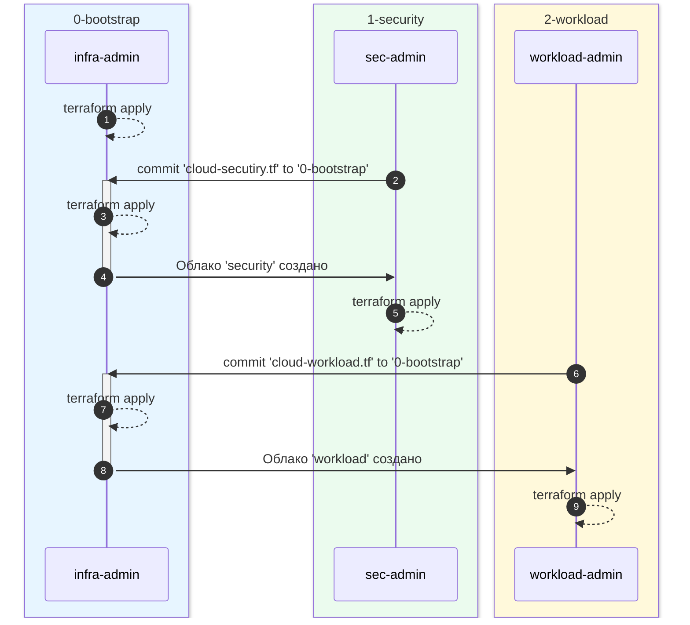

# Yandex Cloud Landing Zone

## Введение
В этом репозитории представлен модуль для создания облачной инфраструктуры организации "под ключ", соответствующий рекомендациям архитекторов Yandex Cloud.
Модуль включает:

* `0-bootstrap` - создание базовой инфраструктуры для развертывания облачных окружений, разграничения доступа и реализации подхода Infrastructure-as-Code;
* `1-security` - создание облака, где размещены ресурсы и сервисы, необходимые для реализации мер информационной безопасности;
* `2-workload` - пример создания "полезной нагрузки" [^1] с применением Terraform модулей из [библиотеки модулей](https://github.com/terraform-yc-modules).

>С точки зрения общего подхода, облако "security" так же является полезной нагрузкой, однако, выделено особенно, чтобы продемонстрировать рекомендованный набор сервисов и применимые настройки.

[^1]: под **полезной нагрузкой** (workload) здесь и далее понимается конфигурация, создаваемая для решения практических задач, например, облако для окружения "dev", "stage", "prod" для разработки, тестирования и размещения прикладного ПО. Полезных нагрузок может быть множество. С точки зрения базовой инфраструктуры, полезная нагрузка - это облако, которое необходимо создать (в общем случае - пустое).

## Концепция
В модуле реализуется подход **изоляции полномочий** - отделения операций, требующих полномочий уровня организации, от операций с полномочиями в конкретном облаке.

- Для создания/удаления облаков, привязки облаков к платежным аккаунтам, создания/удаления групп пользователей, назначения/изменения ролей уровня организации требуются **полномочия уровня организации**. Такие операции выполняются от имени субъекта (пользователя или сервисного акаунта) с соответствющими полномочиями путем изменения и **применения конфигурации в каталоге `0-bootstrap`**.

- Для наполнения и эксплуатации предварительно созданных облаков достаточно **полномочий внутри облака**, выданных группе администраторов конкретного облака. Такие операции выполняются от имени любого субъекта, входящего в группу администраторов, путем изменения и **применения конфигурации в каталоге конкретного облака**.

Ресурсы, необходимые для хранения состояния Terraform и интеграции с решениями CICD, создаются в облаке `bootstrap`. 

## Пререквизиты
- ID организации
- ID платежного аккаунта
- учетная запись, от имени которой создаются ресурсы в организации, должна иметь роли: 
  - `organization-manager.organizations.owner` - владелец организации 
  
  или

  - `resource-manager.admin` на организацию (создавать, редактировать и удалять облака и каталоги, а также управлять доступом к ним);
  - `billing.accounts.editor` на платежный аккаунт (привязывать облака и сервисы к платежному аккаунту).

## Пошаговая инструкция
1. Облако `bootstrap` ([подробная инструкция](0-bootstrap/README.md))
   - [ ] Инициализировать Terraform в каталоге `0-bootstrap`.
   - [ ] Применить конфигурацию из каталога `0-bootstrap`.
   - [ ] Опционально: перенести состояние в бакет, а блокировки - в YDB.
2. Облако `security` ([подробная инструкция](1-security/README.md))
   - [ ] Создание облака.
      - Добавить файл с описанием облака (например, `cloud_security.tf`) в в каталог `0-bootstrap`. 
      - Учетные записи (Yandex ID) будущих администраторов облака `security` задать в переменной `security_cloud_admins`.
      - Применить конфигурацию из каталога `0-bootstrap`.
   - [ ] Наполнение облака.
      - Применить конфигурацию из каталога `1-security`. Выполнять от имени учетной записи или сервисного акаунта, входящих в группу владельцев облака `security`.
3. Облако `workload` ([подробная инструкция](2-workload/README.md))
   - [ ] Создание облака.
      - Добавить файл с описанием облака (например, `cloud_workload.tf`) в в каталог `0-bootstrap`. 
      - Учетные записи (Yandex ID) будущих администраторов облака `workload` задать в переменной `workload_cloud_admins`.
      - Применить конфигурацию из каталога `0-bootstrap`.
   - [ ] Наполнение облака.
      - Применить конфигурацию из каталога `2-workload`. Выполнять от имени учетной записи или сервисного акаунта, входящих в группу владельцев облака.

> Примечание:  
> В целях тестирования все операции можно выполнять от учетной записи владельца организации.

## Ссылки
[0-bootstrap/README.md](0-bootstrap/README.md)  
[1-security/README.md](1-security/README.md)  
[2-workload/README.md](2-workload/README.md)

***

## Общий порядок действий
В модуле создается 3 облака:

- `bootstrap` - минимальный набор ресурсов для обеспечения последующих шагов. Конфигурация хранится в каталоге [0-bootstrap](./0-bootstrap/). В этот же каталог добавляются файлы с описанием ресурсов других облаков, для создания которых требуются полномочия уровня организации.

- `security` - минимальный набор ресурсов для мониторинга событий безопасности при помощи Audit Trails. Конфигурация хранится в каталоге [1-security](./1-security/).

- `workload` - пример облака полезной нагрузки для иллюстрации общего подхода. Конфигурация хранится в каталоге [2-workload](./2-workload/).

Роли:
- Администратор инфраструктуры (infra-admin)
- Администратор безопасности (sec-admin)
- Владелец полезной нагрузки (workload-admin)

Процесс:
1. Администратор инфраструктуры (infra-admin) применяет конфигурацию в каталоге `0-bootstrap`.
2. Администратор безопасности (sec-admin) 
   - описывает облако `security` и отдельные ресурсы, требующие для создания привелегий уровня организации, в одном файле (в нашем примере - [cloud_security.tf](./1-security/for_bootstrap/cloud_security.tf)).
   - передает файл администратору инфраструктуры непосредственно или через репозиторий системы контроля версий.
3. infra-admin проверяет описание облака на соответствие принятым в организации требованиям, сохраняет файл, полученный от sec-admin, в каталог [0-bootstrap](./0-bootstrap/) и применяет обновленную конфигурацию в `0-bootstrap`.
4. infra-admin информирует sec-admin о создании облака `security`.
5. sec-admin применяет локальную конфигурацию для создания дополнительных ресурсов, не требующих привелегий уровня организаии.
6. Владелец полезной нагрузки (workload-admin)
   - описывает облако `workload` и отдельные ресурсы, требующие для создания привелегий уровня организации, в одном файле (в нашем примере - [cloud_workload.tf](./2-workload/for_bootstrap/cloud_workload.tf)).
   - передает файл администратору инфраструктуры непосредственно или через репозиторий системы контроля версий.
7. infra-admin проверяет описание облака на соответствие принятым в организации требованиям, сохраняет файл, полученный от workload-admin, в каталог [0-bootstrap](./0-bootstrap/) и применяет обновленную конфигурацию в `0-bootstrap`.
8. infra-admin информирует workload-admin о создании облака `workload`.
9. workload-admin владелец полезной нагрузки управляет своим облаком предпочтительным для него способом (консоль, SDK, Terraform и т.п.). В нашем примере - это применение конфигурации из каталога [2-workload](./2-workload/). Возможно делегирование ролей другим субъектам (пользователям, сервисным акаунтам).

>Важно: при использовании Terraform администраторы облаков сами управляют хранением состояния своих конфигураций (terraform state).
---
