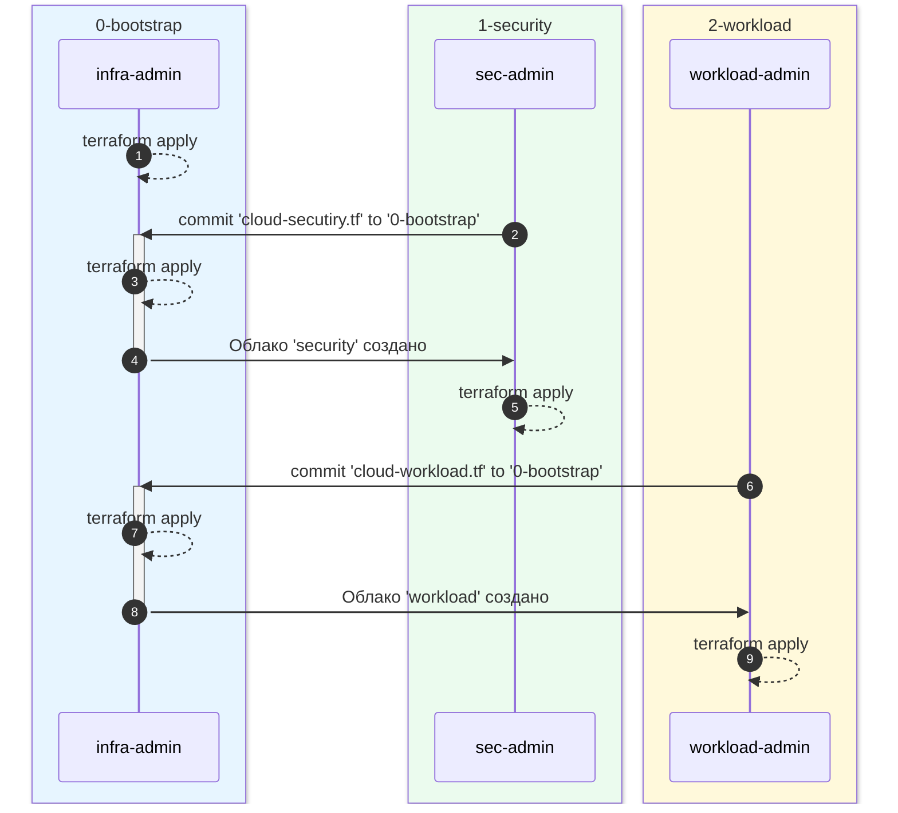

# Yandex Cloud Landing Zone

## Introduction
This repository presents a module for creating a cloud infrastructure for an organization in accordance with the recommendations of Yandex Cloud architects. The module includes:
* `0-bootstrap` - creation of basic infrastructure for deploying cloud environments, access control, and implementation of the Infrastructure-as-Code approach;
* `1-security` - creation of a cloud where resources and services necessary for implementing information security measures are hosted;
* `2-workload` - an example of creating a "workload" [^1] using Terraform modules from the [module library](https://github.com/terraform-yc-modules).

> From a general approach perspective, the "security" cloud is also considered a workload; however, it is highlighted separately to demonstrate the recommended set of services and applicable settings.

[^1]: **Workload** here and further refers to the configuration created to solve practical tasks, for example, a cloud for "dev", "stage", "prod" environments for development, testing, and deployment of application software. There can be many workloads. From the perspective of basic infrastructure, a workload is the cloud that needs to be created (generally empty).

## Concept
The module implements the **separation of privileges** approach - separating operations that require organization-level privileges from operations with privileges in a specific cloud.
- To create/delete clouds, bind clouds to payment accounts, create/delete user groups, assign/change organization-level roles requires **organization-level privileges**. Such operations are performed on behalf of a subject (user or service account) with the appropriate privileges by modifying and **applying configuration in the `0-bootstrap` directory**.
- To operate clouds (create, update and delete resources within the cloud), it is sufficient to have **cloud-level privileges**, granted to the group of administrators of a specific cloud. Such operations are performed on behalf of any subject belonging to the administrator group by modifying and **applying configuration in the specific cloud's directory**. 
- Resources necessary for storing Terraform state and integrating with CICD solutions are created in the `bootstrap` cloud.

## Prerequisites
- Organization ID
- Billing account ID
- The account under which resources are created in the organization must have roles of:
  - `organization-manager.organizations.owner` - organization owner 
  
  or
  
  - `resource-manager.admin` at the organization level (to create, edit and delete clouds and directories, as well as manage access to them);
  - `billing.accounts.editor` on the payment account (to bind clouds and services to the payment account).

## Step-by-Step Instructions
1. Cloud `bootstrap` ([detailed instructions](0-bootstrap/README_EN.md))
   - [ ] Initialize Terraform in the `0-bootstrap` directory.
   - [ ] Apply configuration from the `0-bootstrap` directory.
   - [ ] Move state to a bucket, locks - to YDB; for this:
     - copy the contents of the output parameter `backend_tf` and paste it into the file `backend.tf`;
     - initialize environment variables `AWS_ACCESS_KEY_ID` and `AWS_SECRET_ACCESS_KEY` from the created `.env` file (run `source ./.env`);
     - execute `terraform init -migrate-state`.
2. Cloud `security` ([detailed instructions](1-security/README_EN.md))
   - [ ] Create a cloud.
     - Add a file describing the cloud (for example, `cloud_security.tf`) to the `0-bootstrap` directory.
     - For subsequent filling of the cloud, specify an account (passport or federated) as a member of the group that is granted the role `resource-manager.clouds.owner` on the created cloud.
     - Apply configuration from the `0-bootstrap` directory.
   - [ ] Fill the cloud.
     - Apply configuration from the `1-security` directory. Execute on behalf of an account or service account belonging to the security cloud owner group.
3. Cloud `workload` ([detailed instructions](2-workload/README_EN.md))
   - [ ] Create a cloud.
     - Add a file describing the cloud (for example, `cloud_workload.tf`) to the `0-bootstrap` directory.
     - For subsequent filling of the cloud, specify an account (passport or federated) as a member of the group that is granted the role `resource-manager.clouds.owner` on the created cloud.
     - Apply configuration from the `0-bootstrap` directory.
   - [ ] Fill the cloud.
     - Apply configuration from the `2-workload` directory. Execute on behalf of an account or service account belonging to the owner group of this cloud.

> Note: 
> For testing purposes, all operations can be performed on behalf of an organization owner account.

## Links
[0-bootstrap/README.md](0-bootstrap/README_EN.md)  
[1-security/README.md](1-security/README_EN.md)  
[2-workload/README.md](2-workload/README_EN.md)  

***

## General Order of Actions
The module creates 3 clouds:
- `bootstrap` - minimal set of resources to ensure subsequent steps. Configuration is stored in the [0-bootstrap](./0-bootstrap/) directory. Files describing resources for other clouds requiring organization-level powers are added to this directory.
- `security` - minimal set of resources for monitoring security events using Audit Trails. Configuration is stored in the [1-security](./1-security/) directory.
- `workload` - an example workload cloud illustrating a general approach. Configuration is stored in the [2-workload](./2-workload/) directory.

Roles:
- Infrastructure Administrator (infra-admin)
- Security Administrator (sec-admin)
- Workload Owner (workload-admin)

Process:
1. The Infrastructure Administrator (infra-admin) applies configuration in the `0-bootstrap` directory.
2. The Security Administrator (sec-admin) describes the `security` cloud and individual resources requiring organization-level privileges in one file (in our example - [cloud_security.tf](./1-security/for_bootstrap/cloud_security.tf)).
   - Transfers this file directly to the Infrastructure Administrator or through a version control system repository.
3. The infra-admin checks that the description of the cloud meets organizational requirements, saves the file received from sec-admin in [0-bootstrap](./0-bootstrap/), and applies updated configuration in `0-bootstrap`.
4. The infra-admin informs sec-admin about creating the `security` cloud.
5. The sec-admin applies local configuration to create additional resources... not requiring organization-level privileges.
6. The Workload Owner (workload-admin) describes the `workload` cloud and individual resources requiring organization-level privileges in one file (in our example - [cloud_workload.tf](./2-workload/for_bootstrap/cloud_workload.tf)).
   - Transfers this file directly to the Infrastructure Administrator or through a version control system repository.
7. The infra-admin checks that the description of this cloud meets organizational requirements, saves the file received from workload-admin in [0-bootstrap](./0-bootstrap/), and applies updated configuration in `0-bootstrap`.
8. The infra-admin informs workload-admin about creating the `workload` cloud.
9. The workload-owner manages their cloud using their preferred method (console, SDK, Terraform, etc.). In our example, this involves applying configuration from [2-workload](./2-workload/).

Delegation of roles to other subjects (users, service accounts) is possible.

> Important:  
> When using Terraform, workload cloud administrators manage their Terraform state storag themselves not mixing it with the state of the `bootstrap` cloud.
